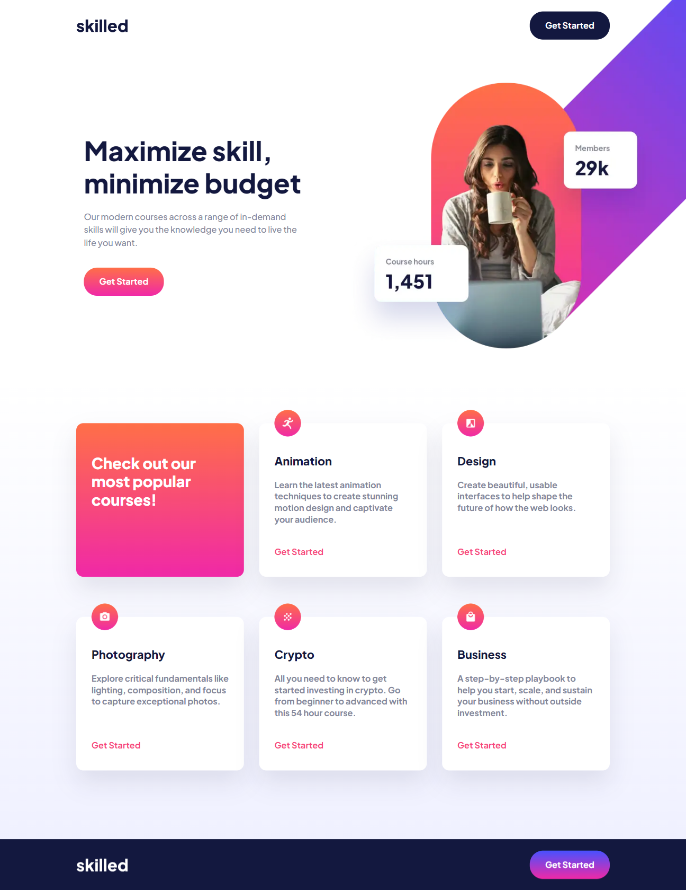

# Frontend Mentor - Skilled e-learning landing page solution

This is a solution to the [Skilled e-learning landing page challenge on Frontend Mentor](https://www.frontendmentor.io/challenges/skilled-elearning-landing-page-S1ObDrZ8q). Frontend Mentor challenges help you improve your coding skills by building realistic projects.

## Table of contents

- [Overview](#overview)
  - [The challenge](#the-challenge)
  - [Screenshot](#screenshot)
  - [Links](#links)
- [My process](#my-process)
  - [Built with](#built-with)
  - [What I learned](#what-i-learned)
  - [Continued development](#continued-development)
  - [Useful resources](#useful-resources)
- [Author](#author)

## Overview

### The challenge

Your challenge is to build out this landing page and get it looking as close to the design as possible.

You can use any tools you like to help you complete the challenge. So if you've got something you'd like to practice, feel free to give it a go.

Users should be able to:

- View the optimal layout depending on their device's screen size
- See hover states for interactive elements

### Screenshot

### Links

- Solution Repository URL: [Add solution URL here](https://github.com/CannyRo/FrontendMentor_SkilledElearningLandingPage_S1ObDrZ8q)
- Live Site URL: [Add live site URL here](https://cannyro.github.io/FrontendMentor_SkilledElearningLandingPage_S1ObDrZ8q/)

## My process

### Built with

- Semantic HTML5 markup
- CSS custom properties
- Flexbox
- CSS Grid
- Mobile-first workflow

### What I learned

I learned, or rather I put my patience to the test, an indispensable quality to be combined with perseverance in order to achieve this challenge. As with other challenges, I don't necessarily find the right solution the first time. So I had to do, undo and redo in order to achieve this result, which remains obviously be improved.

### Continued development

The management of Html elements Picture, Source, Img, etc... in order to have a dynamic management of images directly in Html.

### Useful resources

- [The best CSS Grid resource](https://css-tricks.com/snippets/css/complete-guide-grid/) - This helped me to manage the positioning and organization of blocks.

## Author

- Website - [WhatCannyDev is searching a work-study contract in France](https://cannyro.github.io/hire_mr_canny/en)
- Frontend Mentor - [@CannyRo](https://www.frontendmentor.io/profile/CannyRo)
- GitHub - [@CannyRo](https://github.com/CannyRo)
- LinkedIn - [Ronan CANNY](https://www.linkedin.com/in/ronan-canny-b29443277/)
